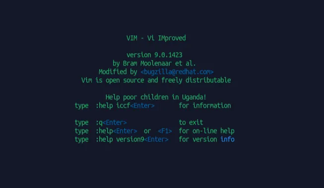
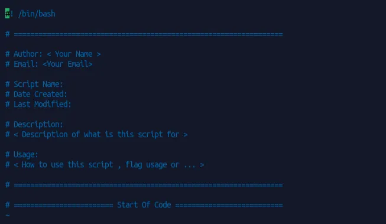

## Have you ever tried creating `Bash`/`Python` or other Script templates with Vim?



Every time I wrote Bash or Python scripts in Vim, I had to add the Shebang `#! /bin/bash` or `#! /usr/bin/python` in the scripts manually.

So how can we automate this process with Vim to catch `*.sh` or `*.py` extensions and create a new file with our desired template, Let’s go for it :

**First, you need to create a template file at `$HOME/.vim/sh_template.temp` with the contents you want:**

```bash
#! /bin/bash

# =================================================================

# Author: < Your Name >
# Email: <Your Email>

# Script Name:  
# Date Created: 
# Last Modified: 

# Description: 
# < Description of what is this script for >

# Usage:
# < How to use this script , flag usage or ... >

# =================================================================

# ======================== Start Of Code ==========================

set -xe
```

**Next, you need to configure `autocmd` in Vim by editing `$HOME/.vimrc` and adding this line:**

```vim
" ========= Shell Script Template ========================
au bufnewfile *.sh 0r $HOME/.vim/sh_template.temp 
```

**Note:**

- Comment lines in vim scripting that are applied in `.vimrc` too, begin with `"` character .
- `au` represents `autocmd`. [_autocmd docs_](https://vimdoc.sourceforge.net/htmldoc/autocmd.html)
- `bufnewfile` event for opening a file that doesn’t exist for editing.
- `*.sh` cath all files with `.sh` extension. For Python scripts, you can replace it with `*.py` .

**Now its time to create a shell script with the desired template:**

`vi Shell_Script.sh`



**Conclusion:**

- You can follow the same steps for every script or language you need.
- Start using [vim](https://www.redhat.com/sysadmin/beginners-guide-vim), you’ll love it ;).
- There’s even a game to learn, give a try [Vim Adventures](https://vim-adventures.com/).
